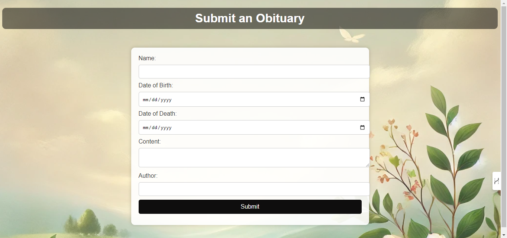
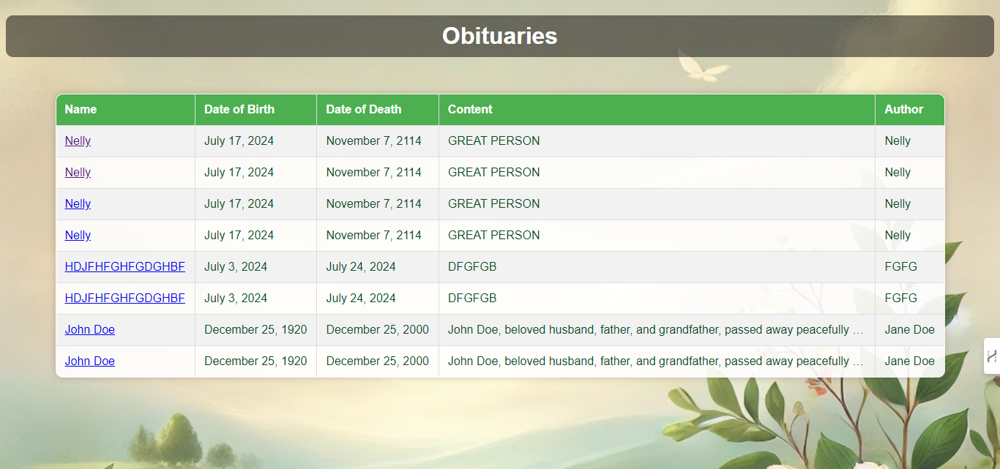
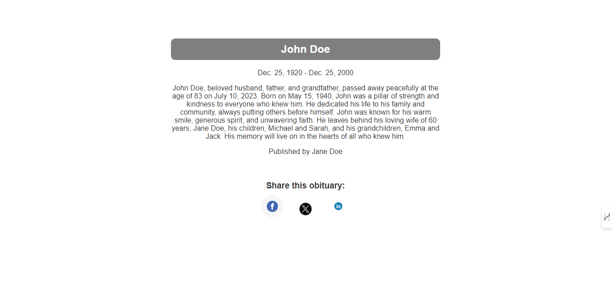

# Obituary Management Platform

The Obituary Management Platform is a web application that allows users to submit, manage, and display obituaries. The platform is built using Django and includes features for SEO and Social Media Optimization to enhance visibility and engagement.

## Features

- Submit obituaries with details such as name, date of birth, date of death, content, and author.
- View a list of submitted obituaries.
- Automatically generate unique slugs for each obituary to prevent duplication.
- Styled with a serene background image and aesthetic form/table design.
- SEO and Social Media Optimization features.

## Technologies Used

- Python
- Django
- HTML/CSS
- SQLite (default database)
- JavaScript (for form validation)

## Prerequisites

Before you begin, ensure you have met the following requirements:

- Python 3.8 or higher
- pip (Python package installer)
- Git

## Setup

### 1. Clone the Repository

git clone <https://github.com/Nelly-Njeri/Obituary-Management-Platform>

cd obituary_management_platform

### 2. Create a Virtual Environment

python -m venv venv

### 3. Activate the Virtual Environment
# On Windows:

venv\Scripts\activate

# On macOS/Linux:

source venv/bin/activate

### 4. Install Dependencies

pip install django

pip freeze > requirements.txt

### 5. Run Migrations

python manage.py makemigrations
python manage.py migrate
### 6. Create a Superuser

python manage.py createsuperuser

### 7. Start the Development Server

python manage.py runserver

#### Development Process

# Key Files and Their Roles
manage.py: The command-line utility for managing the Django project.
settings.py: The settings and configuration for the Django project.
urls.py: The URL declarations for the project.
models.py: Defines the data models for the obituaries.
views.py: Contains the view functions for handling requests and returning responses.
templates/: Contains the HTML templates for rendering the forms and obituary listings.
static/: Contains static files such as CSS and images.

#### Development Steps
Environment Setup: Set up the virtual environment and install dependencies.
Database Creation: Run migrations to create the database schema.
HTML Form Creation: Develop HTML forms for submitting and viewing obituaries.
Backend Logic: Implement view functions to handle form submissions and data retrieval.
Styling: Add CSS and background images to enhance the visual appeal.
SEO and Social Media Optimization: Add meta tags and Open Graph tags for better visibility.
Testing and Validation: Test the application to ensure it works as expected.

#### Usage 

> Submitting an Obituary
Navigate to the submission page: http://127.0.0.1:8000/obituaries/submit/
Fill out the form with the required details.
Click the "Submit" button to submit the obituary.

> Viewing Obituaries
Navigate to the view obituaries page: http://127.0.0.1:8000/obituaries/view/
The page will display a list of submitted obituaries in a table format.

## SEO and Social Media Optimization
Meta Tags: Ensure that each page has appropriate meta tags for title, description, and keywords.
Open Graph Tags: Implement Open Graph tags for better social media sharing previews.
Canonical Tags: Use canonical tags to avoid duplicate content issues.
XML Sitemap: Create and submit an XML sitemap to search engines.

#### Contributing
Fork the repository.
Create a new branch (git checkout -b feature-branch).
Commit your changes (git commit -m 'Add some feature').
Push to the branch (git push origin feature-branch).
Open a pull request.
### Thankyou!
